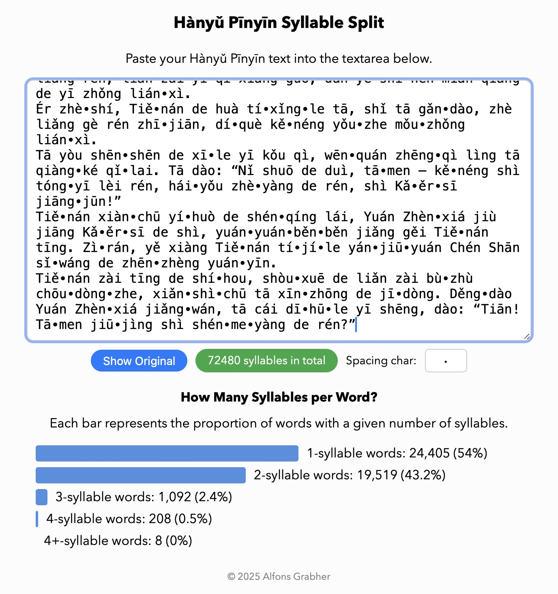

# PinyinSyllableSplitter

A JavaScript class to split Hànyǔ Pīnyīn text into syllables, by Alfons Grabher.

PinyinSyllableSplitter.js licensed under the MIT License.

# Usage and Output

## Example Text Analysis
I transcribed 60% of the novel 天人 by 倪匡 with adherence to the »Basic Rules of Hanyu Pinyin Orthography (GB/T 16159–2012)« 《汉语拼音正词法基本规则》 (GB/T 16159–2012), and used that as input for syllable splitting and counting, in syllable_splitter_with_counter.html:



Note: Attached aspect particles le, zhe, guo are not counted towards syllable length. For example, "yǒu∙zhe", although two syllables, will be counted as a monosyllabic word.

## Example Text

```
Rán'ér, tā yǒudiǎn bùyóu-zìzhǔ zài fādǒu.
```

---

## Split to Syllables

```javascript
const splitter = new PinyinSyllableSplitter();
splitter.splitWords(text);
```

**Output:**
```
Rán∙ér, tā yǒu∙diǎn bù∙yóu∙zì∙zhǔ zài fā∙dǒu.
```

---

## Split to Syllables with Custom Spacing Character

```javascript
const splitter = new PinyinSyllableSplitter(" ");
splitter.splitWords(text);

const splitter = new PinyinSyllableSplitter();
splitter.setSpacingChar(" ");
splitter.splitWords(text);
```

**Output:**
```
Rán ér, tā yǒu diǎn bù yóu zì zhǔ zài fā dǒu.
```

---

### Split One Word into Syllables

```javascript
const splitter = new PinyinSyllableSplitter();
splitter.splitWords("wèishénme");
```

**Output:**
```
wèi∙shén∙me
```

---

## Split and Tag
PinyinSyllableSplitter follows rakutenMA (a morphological analyzer) conventions for Chinese, using language-agnostic POS tags, here PU (punctuation) and X (other).

```javascript
const splitter = new PinyinSyllableSplitter();
splitter.splitAndTag(text);
```

**Output:**
```json
[
  { "syllable": "Rán", "tag": "X" },
  { "syllable": "'", "tag": "PU" },
  { "syllable": "ér", "tag": "X" },
  { "syllable": ",", "tag": "PU" },
  { "syllable": " ", "tag": "PU" },
  { "syllable": "tā", "tag": "X" },
  { "syllable": " ", "tag": "PU" },
  { "syllable": "yǒu", "tag": "X" },
  { "syllable": "diǎn", "tag": "X" },
  { "syllable": " ", "tag": "PU" },
  { "syllable": "bù", "tag": "X" },
  { "syllable": "yóu", "tag": "X" },
  { "syllable": "-", "tag": "PU" },
  { "syllable": "zì", "tag": "X" },
  { "syllable": "zhǔ", "tag": "X" },
  { "syllable": " ", "tag": "PU" },
  { "syllable": "zài", "tag": "X" },
  { "syllable": " ", "tag": "PU" },
  { "syllable": "fā", "tag": "X" },
  { "syllable": "dǒu", "tag": "X" },
  { "syllable": ".", "tag": "PU" }
]
```

---

## Split into a List of Syllables

```javascript
const splitter = new PinyinSyllableSplitter();
splitter.listSyllables(text);
```

**Output:**
```json
[
  "Rán",
  "ér",
  "tā",
  "yǒu",
  "diǎn",
  "bù",
  "yóu",
  "zì",
  "zhǔ",
  "zài",
  "fā",
  "dǒu"
]
```
